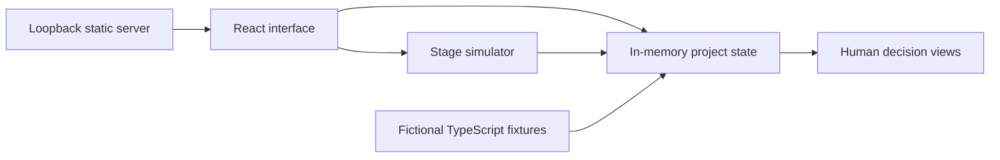

# Agent Workflow Studio

An interactive portfolio demonstration of a staged product workflow: capture an idea, review it through specialist roles, inspect a simulated execution trace, and record a human decision to stop, revise or continue.

> Portfolio demonstration based on a real-world use case; client identity and operational data removed/replaced.

**Every project, metric, agent status and execution log is fictional.** This edition contains a local workflow simulator, not an autonomous agent runtime. No AI provider, OAuth, database, webhook or publishing service is connected.

## Run

Node.js 22.12 or later and npm. Installing dependencies requires registry access; the built demonstration works without external network access.

```sh
npm ci --ignore-scripts
npm run build
npm start
```

Open `http://127.0.0.1:4320`. Use the compiled preview for review; the development server is optional (`npm run dev`).

```sh
npm test
npm run check
```

## Features

- Fictional idea inbox, searchable project cards and idea creation.
- Eight staged roles: analyst, product manager, UX designer, architect, developer, QA, growth and decision board.
- Simulated pipeline progress and local execution logs.
- Fictional metrics, shipping-plan checklists and stop/pivot/scale decisions.
- Local command parser for supported demo commands; no shell execution.
- Generic agent avatars served locally and no personal profile identity.

## Architecture



**Stack:** React, TypeScript, Vite, Tailwind CSS, Lucide icons, motion library, Node.js static server. A committed lockfile makes the installed dependency tree reproducible.

This edition retains selected interface and simulation components from the audited prototype. All original fixture data, personal profile identity, external avatars and deployment/runtime configuration were replaced. The larger live application, OAuth routes, encrypted-token vault, database schema, publication workflows, private environment and original Git history are excluded.

## Honest limits

- Simulator messages and metrics are illustrative, not measured business results, generated artifacts, market validation or successful real agent runs.
- Project changes are browser memory only and reset on refresh.
- A stage is manually triggered and completes after a local timer. It does not perform analysis, generate code, invoke tools or deploy anything.
- The interface has no production authentication, tenancy or durable database; it contains only demo fixtures.
- This is the prototype-derived portfolio edition, not a demonstration that the larger live system has been verified for production security.
- The presentation is primarily desktop oriented. Some workflow views remain prototype interactions.
- Runtime CSS allows inline styles for component compatibility; scripts and network connections remain restricted by the local server's content policy.

## Publication and licensing

Keep source visibility private until the owner explicitly approves public release. Dependencies have their own licenses. Existing Apache-2.0 notices in reused prototype files are preserved, together with [LICENSE](LICENSE) and [NOTICE](NOTICE). Changes in this edition include anonymization, fresh fixtures, removal of external runtime connections and explicit simulation disclosures. These notices do not certify ownership of the source material; the owner must confirm publication rights.
